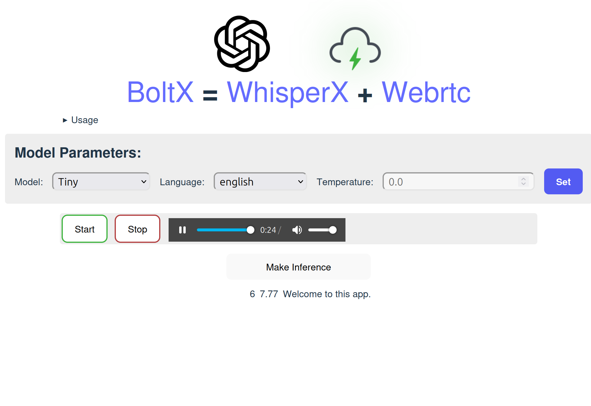

# BoltX

This browser based project let's the whisperX model transcribe incoming audio in realtime.




## Setup
Clone this repo, along with the submodules:
```
git clone --recurse-submodules https://github.com/SlangLab-NU/whisperX-webtrc.git
```
You need ffmpeg to run whisperX:
```bash
sudo apt update && sudo apt install ffmpeg
```
Install the requirements.txt with pip. 

```bash
# in backend
pip3 install -r requirements.txt
```

To start
```bash
cd ../backend && python3 backend.py
```

This API documentation describes an API for a speech-to-text service using FastAPI, integrating `whisperx` for speech recognition and `webrtc` for real-time communication. The API allows authorized users to initiate transcription sessions, offer WebRTC connections for audio streaming, and retrieve transcriptions.


## API Endpoints

### GET `/transcription/ping`
- **Description**: Endpoint to check the API's availability.
- **Response**: Returns `{"ping": "pong"}` to indicate the API is operational.

### POST `/transcription/init`
- **Description**: Initializes a transcription session for an authorized user.
- **Body**:
  - `user_id`: Identifier of the user. The authorized user list is stored in a file on the backend server. TODO: add a database for users
  - `model`: The model name to be used for transcription. See "Available models and languages"
  - `language`: (Optional) The language of the transcription. Defaults to "en".
- **Response**: Returns a unique `token` for the session.
- **Errors**: 1. 403  if the`user_id` is not in the list of authorized users. 2. 400 if the specified model does not exist or there is an error in the initiallization of the model.

### POST `/transcription/offer`
- **Description**: Receives a WebRTC offer for establishing a connection for audio streaming. This api is called in the example frontend when user clicks on start recording button. The SDP information should be passed in to establish a WRTC connection and a subsequent audio track. See example frontend. 
- **Body**:
  - `token`: Session token.
  - `sdp`: Session Description Protocol data.
  - `type`: The type of the offer.
- **Response**: Forwards the offer to the WebRTC service and returns the response.
- **Errors**: 1. 404  if the`token` is invalid

### POST `/transcription/infer`
- **Description**: Starts the transcription process for the audio data received through the WebRTC connection.
- **Body**:
  - `token`: Session token.
- **Response**: Indicates that transcription has started.
- **Errors**: 1. 404  if the`token` is invalid 2. 409 If a transcription job for this session is ongoing. 

## Available models and languages

There are five model sizes, four with English-only versions, offering speed and accuracy tradeoffs. Below are the names of the available models and their approximate memory requirements and relative speed.

|  Size  | Parameters | English-only model | Multilingual model | Required VRAM | Relative speed |
| :----: | :--------: | :----------------: | :----------------: | :-----------: | :------------: |
|  tiny  |    39 M    |     `tiny.en`      |       `tiny`       |     ~1 GB     |      ~32x      |
|  base  |    74 M    |     `base.en`      |       `base`       |     ~1 GB     |      ~16x      |
| small  |   244 M    |     `small.en`     |      `small`       |     ~2 GB     |      ~6x       |
| medium |   769 M    |    `medium.en`     |      `medium`      |     ~5 GB     |      ~2x       |
| large  |   1550 M   |        N/A         |      `large`       |    ~10 GB     |       1x       |

[more information about the models](model-card.md)
